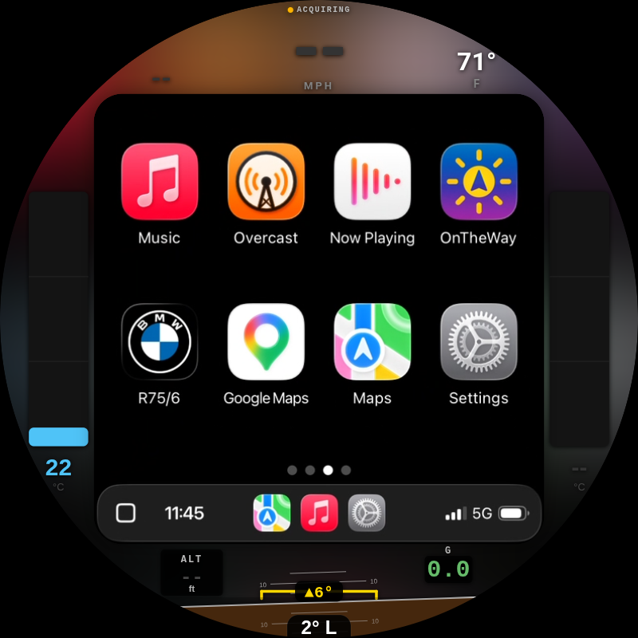
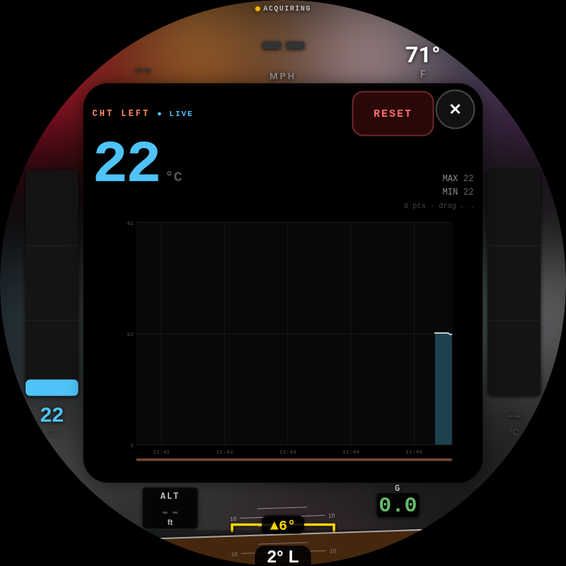

<p align="center">
  <a href="https://byronthegreat.com/projects/motocarplay/"></a>
  
  
  
  
</p>

# motoCarPlay on LIVI

**A hardware-accelerated Apple CarPlay dashboard with live motorcycle instrumentation, built for my 1975 BMW R75/6.**

**Try the live browser demo → [byronthegreat.com/projects/motocarplay](https://byronthegreat.com/projects/motocarplay/)**
_(the dashboard UI running in your browser, driven by a simulated ride; the center CarPlay screen is a static screenshot)_

> **Current version:** this repo is the ride-forward motoCarPlay build.
> The original prototype lives in
> [byroncoughlin/round-carplay](https://github.com/byroncoughlin/round-carplay):
> it proved the round dashboard, sensor overlays, graphing, and ambient backdrop.
> This repo ports/rebuilds that project on
> [LIVI](https://github.com/f-io/LIVI), giving the Pi a native GStreamer video
> path, hardware-accelerated decode, and a compositor that is much better suited
> to actually living on the motorcycle.

CarPlay runs in a centered square on an 800x800 round screen. The curved space
around it becomes the instrument cluster: cylinder-head temps, lean/pitch/G,
GPS speed and heading, ambient temperature, Pi temperature, altitude, and live
history graphs. The optional backdrop can either sample the CarPlay frame for an
average fill color or render a blurred, zoomed copy behind the rounded CarPlay
window so the square feels like it belongs in the circle.

<p align="center">
  
</p>

> **This is a personal build.** It stands on a lot of open-source work:
> [f-io/LIVI](https://github.com/f-io/LIVI) for the modern head-unit foundation,
> [f-io/pi-carplay](https://github.com/f-io/pi-carplay) for earlier Raspberry Pi
> CarPlay work, and
> [OneMakerShow/round-carplay](https://github.com/OneMakerShow/round-carplay)
> for the round-display CarPlay idea that my first motoCarPlay fork started from.
> Full credit stays visible because the project only exists thanks to those
> foundations.

---

## What it does

### CarPlay, centered in the circle

Wireless CarPlay (via a Carlinkit adapter) renders in a clipped, rounded square
inside the 800x800 round panel. The four curved segments around it are the
motorcycle dashboard:

| Arc | Shows |
|---|---|
| **Top** | Compass heading, GPS speed, ambient temperature |
| **Bottom** | Altitude, lean-angle inclinometer, pitch, G-force |
| **Left / Right** | Cylinder-head temperature, one bar gauge per jug, color-coded by heat |

The prototype proved that layout in Electron. The LIVI rebuild keeps the same
round motorcycle idea, but moves the projection path into a native Linux video
pipeline with the CarPlay stream decoded and composed by GStreamer.

### Optional ambient backdrop

Black around the CarPlay square looked too much like a screen dropped into a
hole. MotoCarPlay has two backdrop modes:

| Mode | What it does |
|---|---|
| **Average Color** | Downscales the live CarPlay frame to a small grid, averages the whole crop, and paints the round edges with that sampled color. |
| **Blur Glow** | Crops, shrinks, blurs, and scales the live CarPlay frame behind the foreground window so the bezel picks up the same color and motion. |

Backdrop is a real toggle. When it is off, the app uses the normal projection
pipeline and does not spend work sampling, blurring, or animating the background.
When Blur Glow is on, the blur branch stays tiny and temporally blends each
sampled frame so colorful screens ease instead of jumping.

### Live graphing with risk zones

Tap any metric to open a full-screen graph over the CarPlay card: a big live
number, rolling min/max values, reset controls, and a scrollable history. Graphs
that matter for engine or board health get color risk bands painted under the
trace:

| Metric | Bands |
|---|---|
| **Cylinder-head temp** | cold (blue) → normal (green) → warm (amber) → hot (red) |
| **Pi CPU temp** | healthy (green) → warm (amber) → throttle (red) |

Tap the ambient reading and the screen splits into a dual graph: outside air on
top, Pi CPU temperature below. The Pi lives in a small enclosure, so thermal
headroom matters.

<p align="center">
  
  &emsp;
  
</p>

### Why LIVI

The first motoCarPlay repo proved the dashboard. LIVI made it feel like a
platform:

- native GStreamer projection instead of a software-heavy browser video path
- hardware decode on Raspberry Pi 5
- a compositor that can keep the video plane under transparent UI
- faster clean restarts after mode changes
- a better base for Carlinkit, CarPlay, Android Auto, audio, and future head-unit work

In plain terms: the old repo is the prototype; this repo is the version I want
to keep riding forward.

---

## Parts list

Everything connects to the Pi's GPIO or USB. Prices are what I actually paid
for the original motoCarPlay build (USD); yours will vary.

### Compute & display

| Part | What I used | Qty | Price |
|---|---|--:|--:|
| Pi 5 (2GB) + active cooler + case | iRasptek Basic Kit for Raspberry Pi 5 (2GB) | 1 | $110.99 |
| microSD card | SanDisk Extreme PRO 32GB (A1 / U3 / V30) | 1 | $31.99 |
| Round touchscreen | Waveshare 3.4" HDMI Round, 800x800 IPS, 10-pt touch | 1 | $105.99 |
| Enclosure | 3D-printed Pi case + display back (own filament) | 1 | DIY |

### CarPlay

| Part | What I used | Qty | Price |
|---|---|--:|--:|
| Wireless CarPlay adapter | Carlinkit **CPC200-CCPA** | 1 | $55.99 |

### Sensors

| Part | What I used | Qty | Price |
|---|---|--:|--:|
| GPS receiver | Adafruit Ultimate GPS GNSS w/ USB (99-ch, 10 Hz) | 1 | $29.95 |
| GPS antenna | Adafruit External Active Antenna, 28 dB, 5 m, SMA | 1 | $21.50 |
| Antenna pigtail | u.FL → SMA RG178 jumper (5-pack, used 1) | 1 | $6.99 |
| GPS backup cell | CR1220 coin cell (GPS module almanac, faster warm fix) | 1 | $2.49 |
| IMU (lean / pitch / G) | Adafruit **BNO055** 9-DOF (UART mode) | 1 | $39.10 |
| Ambient temp | BOJACK **DS18B20** waterproof probe kit (incl. pull-up) | 1 | $8.99 |
| CHT amplifier | Adafruit **MAX31856** universal thermocouple board | 2 | $35.00 |
| CHT thermocouple | K-type probe w/ **14 mm** spark-plug washer, 3 m lead | 2 | $31.98 |

### Real-time clock

| Part | What I used | Qty | Price |
|---|---|--:|--:|
| RTC battery | ML2032 rechargeable Li coin cell | 1 | $8.99 |
| RTC holder | RTC battery box for Pi 5 (cell not included) | 1 | $5.49 |

### Cabling & adapters

| Part | What I used | Qty | Price |
|---|---|--:|--:|
| Jumper wires | 120-pc Dupont kit (M-F / M-M / F-F) | 1 | $8.99 |
| HDMI cable | Cable Matters ultra-thin HDMI, 6 ft (2-pack, used 1) | 1 | $15.99 |
| HDMI right-angle | 180° HDMI M-F U-shaped adapter (2-pack, used 1) | 1 | $10.99 |
| Micro-HDMI adapter | Micro-HDMI M → HDMI F 180° angled (2-pack, used 1) | 1 | $9.99 |
| USB-C → USB-A cable | Amazon Basics, 6 ft | 1 | $2.82 |

**Parts subtotal: ≈ $544** (+ $13.84 Adafruit shipping & tax on the GPS order).
Excludes the 3D-printed enclosure and the iPhone you already own.

> **Why these specific parts:**
> - The R75/6 takes **14 mm** spark plugs, so the thermocouple washers are 14 mm.
> - The **BNO055 runs over UART, not I2C**. I had trouble with it on I2C.
> - The Waveshare panel is **HDMI**, so the Pi 5's micro-HDMI is adapted to it.

---

## Instrument wiring & Pi setup

The R75/6 has no OBD port and no CAN bus, so the bike learns to speak through
discrete sensors wired to the Pi. The original prototype repo still has the
fresh-flash wiring/setup notes:

- [PI setup notes](https://github.com/byroncoughlin/round-carplay/blob/main/PI_SETUP.md)
- [Full wiring map](https://github.com/byroncoughlin/round-carplay/blob/main/WIRING.md)

Quick map:

| Sensor | Bus |
|---|---|
| BNO055 IMU (lean/pitch/G) | UART |
| CHT left/right (MAX31856 x2) | SPI |
| Ambient (DS18B20) | 1-Wire |
| GPS (Adafruit Ultimate, USB) | USB serial |
| Pi CPU temp | `/sys/class/thermal` |

LIVI handles the projection/video/compositor side. The motorcycle sensors feed
the round overlay layer and graph history.

---

## Build & deploy

### Build host prerequisites

- Node.js 24+ with `corepack` / `pnpm`
- Python 3.x
- GStreamer development headers
- `libusb-1.0-0-dev`, `libudev-dev`
- Linux compositor dependencies used by `scripts/compositor/build-linux.sh`

On the Pi build host I use the repo's `pnpm` workflow:

```bash
pnpm install --frozen-lockfile
pnpm run build:armLinux:appimage
```

That produces an ARM64 AppImage under `dist/`.

### Deploy to the Pi

```bash
rsync -az --progress dist/LIVI-*-arm64.AppImage \
  byron@motocarplay.local:/home/byron/LIVI/LIVI.AppImage

ssh byron@motocarplay.local "chmod +x /home/byron/LIVI/LIVI.AppImage && sudo reboot"
```

The Pi autostarts `/home/byron/LIVI/LIVI.AppImage` on boot.

---

## Settings reference

The motorcycle build keeps settings intentionally small.

### System

| Setting | Typical | What it does |
|---|---|---|
| **Wi-Fi Frequency** | 5 GHz | Wireless CarPlay adapter band. |
| **Auto Connect** | On | Bring the dongle/phone session up automatically. |
| **Preferred Connection** | Dongle | Use the Carlinkit path for CarPlay. |
| **FPS** | 45 | Projection frame rate requested from the phone. |
| **DPI** | 140 | CarPlay UI scaling hint. |
| **View Area** | 118 px on all sides | Crops the phone stream into the square inside the round panel. |

### Moto Display

| Control | What it does |
|---|---|
| **Backdrop** | Enables/disables optional CarPlay-derived background rendering. |
| **Backdrop Style** | Average Color or Blur Glow. Changing this requires a clean app restart. |
| **Ambient Fill** | Uses a fixed fill color when dynamic backdrop is off. |
| **Fill Color** | Manual round-edge fill color. |
| **Round Corners** | Clips the CarPlay window corners so it looks native inside the dashboard. |
| **Tilt Calibration** | Zeros lean/pitch with the bike sitting level. |
| **Graph History** | Clears stored graph traces. |

---

## Credits

- Current foundation: [f-io/LIVI](https://github.com/f-io/LIVI)
- Raspberry Pi CarPlay lineage: [f-io/pi-carplay](https://github.com/f-io/pi-carplay)
- Original round-display idea: [OneMakerShow/round-carplay](https://github.com/OneMakerShow/round-carplay)
- First motoCarPlay prototype: [byroncoughlin/round-carplay](https://github.com/byroncoughlin/round-carplay)

See [`CREDITS.md`](CREDITS.md) for a longer list of prior art and third-party components.

## Disclaimer

_Apple and CarPlay are trademarks of Apple Inc. This project is not affiliated
with or endorsed by Apple. All trademarks are the property of their respective
owners. Mounting a screen on a motorcycle and reading it while riding is done at
your own risk. Keep your eyes on the road._

## License

MIT. See [`LICENSE`](LICENSE).
